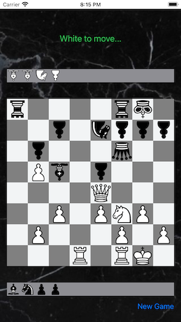

# ChessboardSwiftUI

ChessboardSwiftUI is a SwiftUI application. It uses a LazyVGrid for the board and gesture handling for moving the pieces.

It acts as a digital chessboard, and checks for legal moves. Although a couple of more esoteric checks are not implemented. And, while it can check for mate, it doesn't. Which lets you test things easier. But the code is there and can be easily put back in for a real game.

## License

ChessboardSwiftUI  is licensed under the Unlicense. See the LICENSE file for more information, but basically this is sample code and you can do whatever you want with it.
